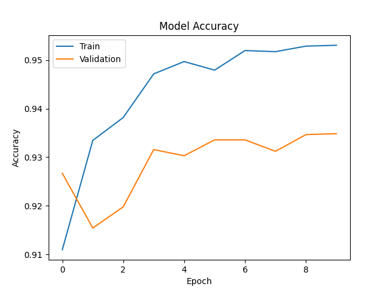
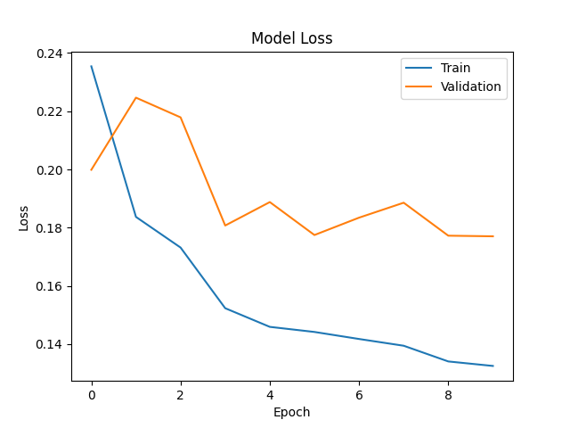
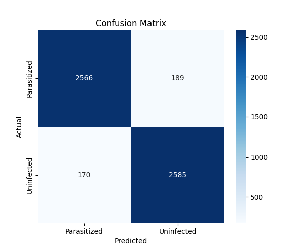
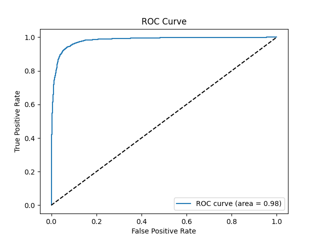
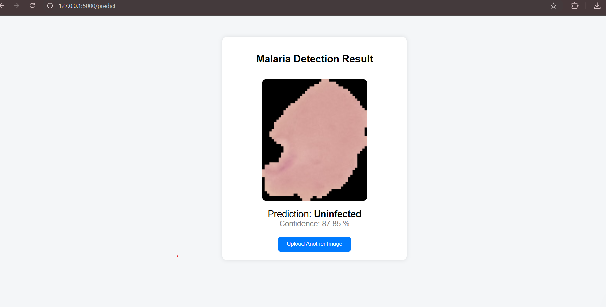

# Malaria Detection using Deep Learning

This project detects malaria infection from blood smear microscopy images using a deep learning model.

## Technologies Used

- Python
- TensorFlow / Keras
- OpenCV
- Flask
- HTML/CSS

## Model

The model is trained using MobileNetV2 on the Malaria Cell Images dataset.

Classes:
- Parasitized
- Uninfected

## Features

- Upload microscopy image
- Detect malaria infection
- Display prediction and confidence score
- Simple web interface using Flask

## How to Run

Clone the repository:

git clone <repo_link>

Install dependencies:

pip install -r requirements.txt

Run the app:

python app.py

Open browser:

http://127.0.0.1:5000

## Model Performance

### Accuracy Graph

### Loss Graph

### Confusion Matrix

### ROC Curve

## Web Application Interface

### Upload Page

### Prediction Result

## Model Training Notebook

The deep learning model was trained using Google Colab.

You can view the full training notebook here:

notebooks/malaria.ipynb
